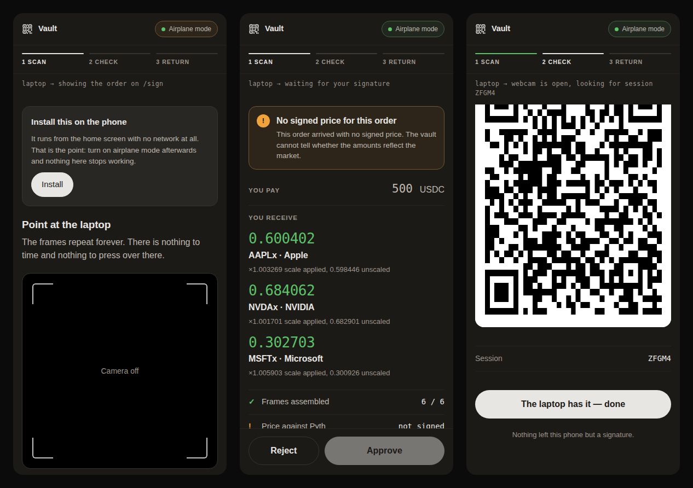
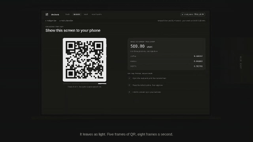

<div align="center">

# PixStock

**Ledger-grade security for tokenized stocks, using the phone already in your drawer.**

The only signer that checks the market price offline before it signs.

[](./LICENSE)
[](https://solana.com)

**[What to check, and where](./PITCH.md)** · [AGQP spec](./docs/AGQP-SPEC.md) ·
[Threat model](./docs/THREAT-MODEL.md) · [Reproduce the demo](./docs/DEMO.md)

**[Open the dApp](https://web-production-502d1.up.railway.app)** ·
**[Open the vault](https://pixstock-production.up.railway.app)** ·
[Relayer health](https://relayer-production-b097.up.railway.app/healthz)

**[▶ Watch the two-minute demo](https://github.com/PixStock/pixstock/releases/download/v0.1.4/pixstock-stocklana-demo.mp4)**
— 1080p, 13 MB, hosted on the release rather than a video platform.
<sub>The interfaces in it are recreated from the running app; the transaction
it ends on is [real](https://solscan.io/tx/mXU5gcq9zUxr4twZzcRCfagwZgSSk3fZcsMAXURddMhBCAJ3auzFnEoNNDYgbpZndNCjSKcrkmEetbKaKUuZvir).</sub>



<sub>The signer, on a phone with its radios off. It waits, it shows what it
decompiled from the transaction itself — and says plainly that no signed price
came with this order — and it answers with sixty-four bytes. Generated from
the running app by `npm run screenshots`, so it cannot drift from the product.</sub>

</div>

---

## It has already happened, on mainnet

One confirmed swap, real money, and a vault that has **never held a lamport**:

> [`mXU5gcq9…uZvir`](https://solscan.io/tx/mXU5gcq9zUxr4twZzcRCfagwZgSSk3fZcsMAXURddMhBCAJ3auzFnEoNNDYgbpZndNCjSKcrkmEetbKaKUuZvir)
> — slot 447518920, `err: None`, two signatures. 0.5 USDC into TSLAx.

The vault is [`5EhC1QpR…iJLJH`](https://solscan.io/account/5EhC1QpRm8BuLBJi6sqikvp8a7jYf6oLjZBtn9kiJLJH). Its
balance is zero, and it is zero on both sides of the only two transactions it
has ever appeared in. So this is not a vault that was emptied for the
screenshot — it is one that has never been funded.

Open the transaction. The fee payer is `2oQgk1TC…cSfof`, the relayer. The
vault is listed as a signer that is **not writable**, which is the part worth
pausing on: this is not merely a transaction that did not take the vault's
SOL, it is one that could not have. The other signature came off a phone in
airplane mode and crossed the room as sixty-four bytes of QR. Nothing in
between could have moved a token, and nothing in between ever saw the key.

And the vault is deployed, so the claim everything else rests on is one you
can check in your own browser rather than take from us. Open
[the vault](https://pixstock-production.up.railway.app), open the devtools
console, and ask the page to reach the network — by all three of the ways it
could:

```js
addEventListener("securitypolicyviolation", (e) =>
  console.log("blocked", e.blockedURI, "by", e.effectiveDirective));

fetch("https://example.com");                 // TypeError: Failed to fetch
new WebSocket("wss://example.com");
const x = new XMLHttpRequest();
x.open("GET", "https://example.com"); x.send();

// blocked https://example.com/ by connect-src
// blocked wss://example.com/   by connect-src
// blocked https://example.com/ by connect-src
```

The response header is `connect-src 'none'`. That is not a promise about our
code — it is the browser refusing on our behalf, and it binds any script that
ever runs on that page, ours or not, injected or not.

---

## The problem

Tokenized stocks trade on Solana today, but holding them safely does not.
A retail investor outside the US has two options, and both are bad: leave the
keys on an exchange and inherit its counterparty risk, or buy a hardware
wallet — a purchase, a shipment, a seed phrase ceremony, and a device that
still shows you a hash and asks you to trust it.

There is a third option nobody has built: **the old smartphone in your
drawer**. Put it in airplane mode permanently and it is already an air-gapped
signer with a camera, a screen, a secure element and a biometric sensor.

## What we built

PixStock turns any spare phone into an offline signer for tokenized stocks.
The phone never touches a network again — no Wi-Fi, no Bluetooth, no cable.
Transactions cross the gap **optically**, as animated QR codes read by the
camera, and the signature comes back the same way through the laptop's webcam.

Five things make it usable rather than a demo:

| | |
|---|---|
| **Zero-SOL cold storage** | The web dApp is the fee payer. Your vault can hold 0.00 SOL and still trade — no one has to learn what a lamport is. |
| **No blind signing** | The phone decompiles the transaction itself and shows a readable order ticket: assets, exact amounts in and out, counterparty. Never a hash. |
| **A basket in one scan** | Three Jupiter swaps in a single transaction — 40% AAPLx / 30% NVDAx / 30% MSFTx for one USDC amount, signed once. |
| **Offline price check** | The phone verifies an Ed25519-signed Pyth price and **refuses to sign** if the order drifts more than 1% from it. A corrupted browser cannot lie to it. |
| **Paper-Vault** | The encrypted key exports as a printable QR. No cloud, no vendor. |

## How it works

```
  Web dApp (online)                         Vault (airplane mode)
        │                                            │
        │ 1. build order, inject fee payer + nonce   │
        │ 2. attach the Pyth signed price            │
        │ 3. AGQP encode ──── animated QR ──────────►│ 4. camera, CRC32 reassembly
        │                                            │ 5. verify Pyth signature
        │                                            │ 6. readable order ticket
        │                                            │ 7. biometric confirmation
        │ 9. webcam ◄───── static QR (64 bytes) ─────┘ 8. Ed25519 signature
        │ 10. broadcast
        ▼
     Solana
```

The split matters: the vault holds the only key that can move your assets and
has no code path that can reach a network. The relayer pays fees and advances
a durable nonce — it can never move a token. The web app displays and scans,
and signs nothing.

**Why Solana specifically:** the fee payer is separate from the signer
natively, durable nonces exist precisely so a signature can be produced
offline without a clock running, xStocks are Token-2022 with real liquidity,
Jupiter routes the swaps and Pyth publishes signed prices that verify with a
single Ed25519 check.

---

## Repository layout

```
apps/
├── web/        Next.js 16 — the online dApp: trade, basket builder, QR display and webcam return
├── vault/      Vite + React PWA — the offline signer. No fetch, no network, ever.
└── relayer/    NestJS — quotes, transaction building, fee payer, nonce pool, broadcast
packages/
├── agqp/           The optical protocol: frames, Base45, CRC32, session assembler
├── tx-policy/      v0 message decompilation, instruction decoding, P1..P12 signing policy
├── pyth-verify/    Offline Pyth Pro parsing and Ed25519 verification
├── vault-crypto/   Key generation, AES-GCM-256, Argon2id, Paper-Vault, signing
└── shared/         Asset table, program ids, order types
docs/           ARCHITECTURE · AGQP-SPEC · THREAT-MODEL · DEMO · DEPLOY · TESTING
```

## Quickstart

Requires **Node.js 20+** and **npm 10+**. PostgreSQL 15+ for the relayer.

```bash
git clone https://github.com/PixStock/pixstock
cd pixstock
npm install
npm run build:packages
```

Then, in three terminals:

```bash
npm run dev -w @pixstock/relayer   # API      → http://localhost:4000
npm run dev -w @pixstock/web       # dApp     → http://localhost:3000
npm run dev -w @pixstock/vault     # Vault    → http://localhost:5183
```

The relayer needs a database and a few keys — copy `apps/relayer/.env.example`
to `apps/relayer/.env` and fill it in. The vault needs nothing: that is the
point.

> The camera and WebAuthn require HTTPS on a real phone. Use `mkcert` for a
> trusted local certificate, or open the deployed vault URL.

### Commands

```bash
npm run build            # packages, then all three apps
npm run build:packages   # shared packages only (run this after changing one)
npm run dev:packages     # watch mode for the packages

npm test                 # unit + integration — offline, deterministic
npm run test:live        # against the real Jupiter API and an RPC node
npm run test:system      # Playwright, both apps in a browser (see below)
npm run test:all         # all three

npm run typecheck        # project-wide type check
npm run lint             # every workspace that defines a linter

npm run screenshots      # redraws the three vault screens above, from the app
```

The system tests need a browser once per machine:

```bash
npx playwright install chromium
```

Every test command builds the shared packages first, and Playwright starts the
dev servers it needs. What each layer catches, and why the live suite is kept
separate: [`docs/TESTING.md`](./docs/TESTING.md).

## Status

The loop is closed and runs on mainnet data: the web app builds a real
Jupiter order, the phone reads it through the camera, checks Pyth's signature
on the price with no network, prints a readable ticket, signs, and the
relayer co-signs and broadcasts. 326 unit and integration tests, 36 system
tests in a real browser, and every one of the twelve signing rules enforced.

Three things are worth saying plainly, because a demo that hides them is
worse than one that does not:

- **Broadcasting is off by default.** It spends real SOL and cannot be
  undone, so it stays behind `RELAYER_ALLOW_BROADCAST` until someone turns it
  on deliberately. Everything up to it — building, quoting, co-signing,
  simulating — works with it off.
- **The price check rests on a Pyth Pro grant.** All five xStock feeds are
  covered, at one update per second — the grant's rate limit, not the feeds'.
  A grant is not a right: if it lapses, an order travels with a price for the
  legs it still covers, the ticket names the ones it does not, and the phone
  asks the holder to accept that before it will sign. That path stays tested
  for the day it is needed.
- **The nonce pool has to be created before a demo.** Without a durable
  nonce an order dies with its blockhash in about ninety seconds. Creating
  one costs rent, so it is a command someone runs — `npm run nonces:create`
  — never a side effect of the service starting.

Every public function that is not written yet throws with a pointer to the
spec section that defines it, so nothing fails silently.

---

## Documentation

| File | Contents |
|---|---|
| [`PITCH.md`](./PITCH.md) | Each must-have → the file that implements it → the test that proves it |
| [`docs/ARCHITECTURE.md`](./docs/ARCHITECTURE.md) | Components, end-to-end flow, target timings |
| [`docs/AGQP-SPEC.md`](./docs/AGQP-SPEC.md) | The optical protocol, frame by frame |
| [`docs/THREAT-MODEL.md`](./docs/THREAT-MODEL.md) | What each component may never do, policies P1..P12 |
| [`docs/DEMO.md`](./docs/DEMO.md) | How to reproduce the demo end to end |
| [`docs/DEPLOY.md`](./docs/DEPLOY.md) | Deploying the three pieces, and what each may do |
| [`docs/TESTING.md`](./docs/TESTING.md) | The four test layers and what each one catches |
| [`CLAUDE.md`](./CLAUDE.md) | Development conventions — the team's working document |
| [`GIT.md`](./GIT.md) | Branch, commit and PR conventions |

## Getting your keys out

The vault holds an ordinary Ed25519 key. There is no proprietary format to be
locked into and no service to ask permission from, and the way out does not
depend on this project still existing.

The app itself has no "send" button — the signing policy allows Jupiter swaps
and nothing else, so a plain transfer is not something it can build or the
vault would sign. Moving funds somewhere else means taking the key with you,
which is a supported path rather than an escape hatch:

```bash
node scripts/export-key.mjs
```

It takes either the Paper-Vault code — **Settings → Show my Paper-Vault**, any
time, since the sheet is ciphertext and needs no password to display — or the
raw blob from the vault's `localStorage`. It prints the account's private key
in the base58 form Phantom and Solflare import, and as the JSON array
`solana-keygen` expects.

It reads both the vault and the password from stdin rather than from
arguments, so neither reaches your shell history or the process list, and it
performs no network I/O. What it prints is the account itself: anyone holding
it can move everything, with no password and no second step.

## Watch the film

[](https://github.com/PixStock/pixstock/releases/download/v0.1.4/pixstock-stocklana-demo.mp4)

<sub>Seven seconds of it, silent and looping: the order leaving the laptop as
five QR frames, and the phone refusing an order whose price moved three
percent. **[The whole two minutes, with sound](https://github.com/PixStock/pixstock/releases/download/v0.1.4/pixstock-stocklana-demo.mp4)**
— 1080p, 13 MB. GitHub strips `<video>` from a README, so the film itself is a
download; this loop is here so you can see what it is before deciding to spend
two minutes on it.</sub>

## Open source components

Jupiter Swap API · Pyth Pro (ex-Lazer) · Backed Finance xStocks ·
`@solana/web3.js` · `@noble/curves` · `@noble/hashes` · `hash-wasm` (Argon2id) ·
`@scure/base` (Base45) · `cbor-x` · `jsqr` (the dApp reads the reply) · `qrcode`

The vault decodes QR with the browser's own `BarcodeDetector`, not a library:
the app that may never fetch anything ships no scanner of its own.

## Contributing

See [`CONTRIBUTING.md`](./CONTRIBUTING.md).

## Security

Never open a public issue for a vulnerability — see
[`SECURITY.md`](./SECURITY.md).

## License

[MIT](./LICENSE) © 2026 PixStock
